# Benchmark Results

**Generated:** 2026-07-05 20:09

**Hardware:** NVIDIA GeForce RTX 5090 (32 GB VRAM)

## Overview

This report summarizes benchmark results across multiple vision-language models (VLMs) 
and vision encoders. Benchmarks cover image captioning, visual question answering (VQA), 
object detection, phrase grounding, pose estimation, and oriented bounding box (OBB) detection.

### Models Tested

| Category | Models |
|----------|--------|
| Vision Encoders | DINOtool, DINOv3, SigLIP2, MoonViT |
| VLMs (caption + VQA) | Florence-2, PaliGemma2, Phi-3.5-Vision, Cosmos-Reason1-7B, Llama-3.2-11B-Vision, Qwen3-VL-8B-Instruct, Qwen3-VL-8B-Thinking |
| VLMs (diffusion) | DiffusionGemma-26B (5 variants) |
| Detection | YOLO11n, YOLO26n, YOLO26n (Pose), YOLO26n (OBB), LocateAnything-3B |

### Notes

- **50 images** per model for captioning (25 for slow models: qwen3_thinking, phi4_multimodal, diffusion_gemma variants)
- **100 questions** per model for VQA
- **50 images** per model for OD, pose, OBB, grounding
- Vision encoders use zero-shot classification via DINO/transformer features + sentence-transformers (not trained for captioning)
- Phi-3.5-Vision is very slow (~15s/image) without flash-attention on Blackwell GPU
- DiffusionGemma variants need ~50-60s/image

## 1. Image Captioning (COCO Captions)

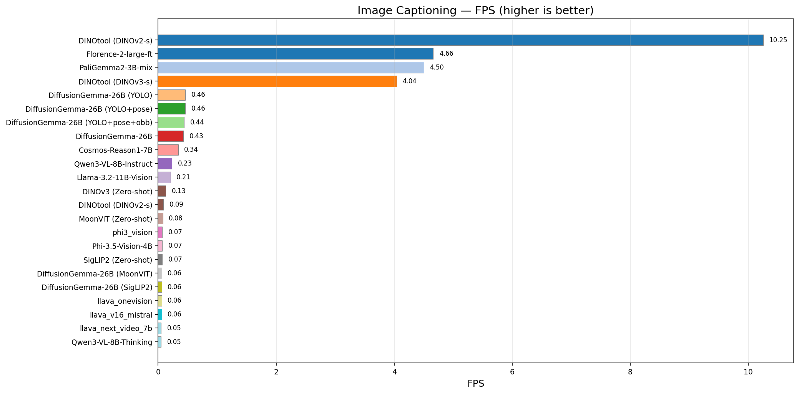
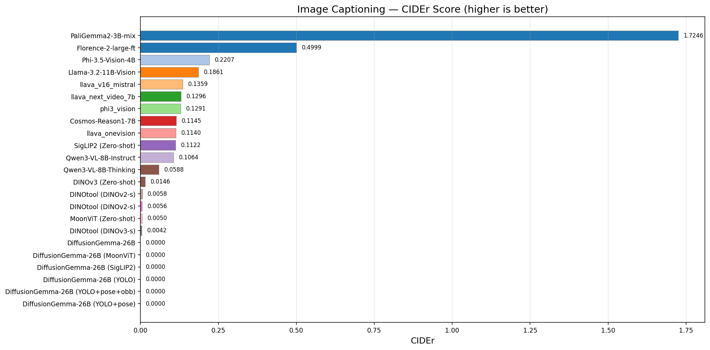
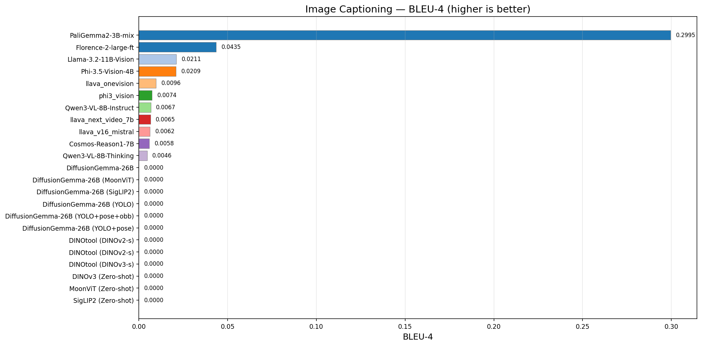
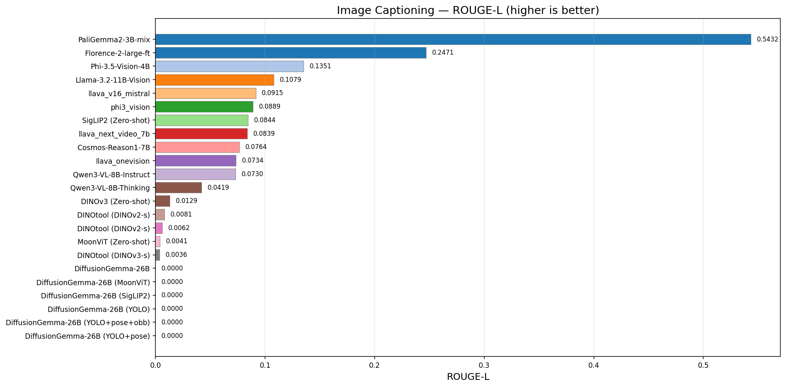

| Model | FPS | CIDEr | BLEU-4 | ROUGE-L | Avg (ms) | Images |
|-------|-----|-------|--------|---------|----------|--------|
| PaliGemma2-3B-mix | 4.56 | 1.7246 | 0.2995 | 0.5432 | 219.1 | 50 |
| Florence-2-large-ft | 3.79 | 0.4999 | 0.0435 | 0.2471 | 264.2 | 50 |
| Cosmos-Reason1-7B | 0.34 | 0.1177 | 0.0059 | 0.0766 | 2943.8 | 50 |
| Qwen3-VL-8B-Instruct | 0.23 | 0.1064 | 0.0067 | 0.0730 | 4399.5 | 50 |
| Llama-3.2-11B-Vision | 0.20 | 0.1764 | 0.0226 | 0.1009 | 5010.7 | 50 |
| DINOv3 (Zero-shot) | 0.16 | 0.0146 | 0.0000 | 0.0129 | 6291.7 | 50 |
| SigLIP2 (Zero-shot) | 0.12 | 0.1122 | 0.0000 | 0.0844 | 8651.5 | 50 |
| DINOtool (DINOv2-s) | 0.10 | 0.0056 | 0.0000 | 0.0081 | 10230.1 | 50 |
| MoonViT (Zero-shot) | 0.09 | 0.0050 | 0.0000 | 0.0041 | 10580.5 | 50 |
| DiffusionGemma-26B (MoonViT) | 0.06 | 0.0000 | 0.0000 | 0.0000 | 16107.7 | 25 |
| DiffusionGemma-26B (SigLIP2) | 0.06 | 0.0000 | 0.0000 | 0.0000 | 17445.0 | 25 |
| Phi-3.5-Vision-4B | 0.06 | 0.2245 | 0.0208 | 0.1364 | 15626.0 | 50 |
| Qwen3-VL-8B-Thinking | 0.06 | 0.0614 | 0.0057 | 0.0412 | 17465.4 | 25 |
| DiffusionGemma-26B (YOLO) | 0.02 | 0.0963 | 0.0000 | 0.0744 | 61219.9 | 25 |
| DiffusionGemma-26B | 0.01 | 0.0963 | 0.0000 | 0.0744 | 66734.7 | 25 |

## 2. Visual Question Answering (COCO)

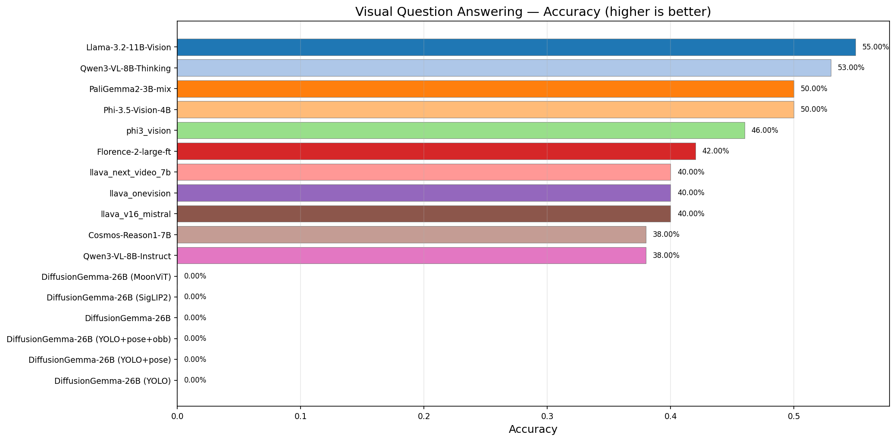
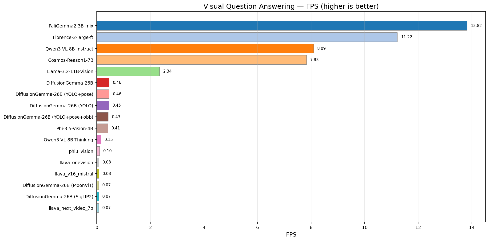

| Model | Accuracy | FPS | Avg (ms) | Questions |
|-------|----------|-----|----------|-----------|
| Llama-3.2-11B-Vision | 64.00% | 2.55 | 392.5 | 100 |
| Phi-3.5-Vision-4B | 57.00% | 0.43 | 2299.7 | 100 |
| Qwen3-VL-8B-Thinking | 56.00% | 0.27 | 3722.8 | 100 |
| PaliGemma2-3B-mix | 54.00% | 15.51 | 64.5 | 100 |
| Qwen3-VL-8B-Instruct | 41.00% | 11.68 | 85.6 | 100 |
| Florence-2-large-ft | 37.00% | 11.19 | 89.3 | 100 |
| Cosmos-Reason1-7B | 35.00% | 8.05 | 124.3 | 100 |

## 3. Object Detection (COCO)

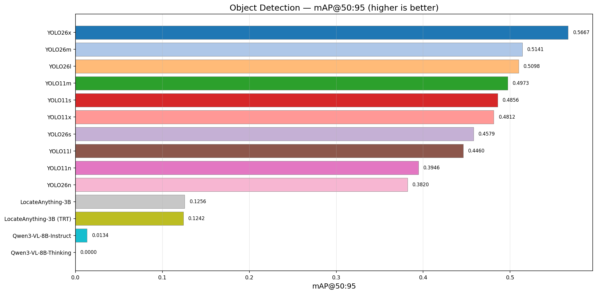
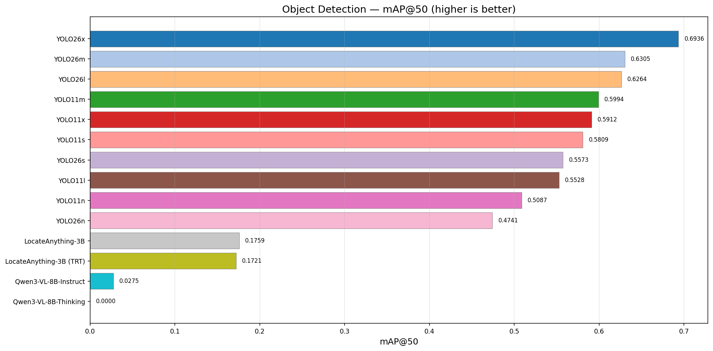
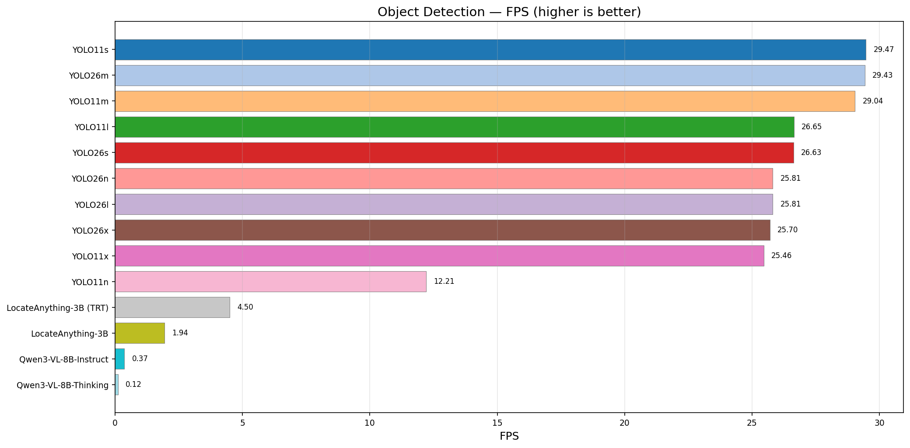

| Model | mAP@50:95 | mAP@50 | FPS | Avg (ms) | Images |
|-------|-----------|--------|-----|----------|--------|
| YOLO11n | 0.3946 | 0.5087 | 46.70 | 21.4 | 50 |
| YOLO26n | 0.3820 | 0.4741 | 14.79 | 67.6 | 50 |
| LocateAnything-3B | 0.1255 | 0.1758 | 3.41 | 293.2 | 48 |
| Qwen3-VL-8B-Thinking | 0.0568 | 0.0778 | 0.19 | 5215.1 | 25 |
| Qwen3-VL-8B-Instruct | 0.0134 | 0.0275 | 0.51 | 1959.2 | 48 |

## 4. Pose Estimation (COCO Keypoints)

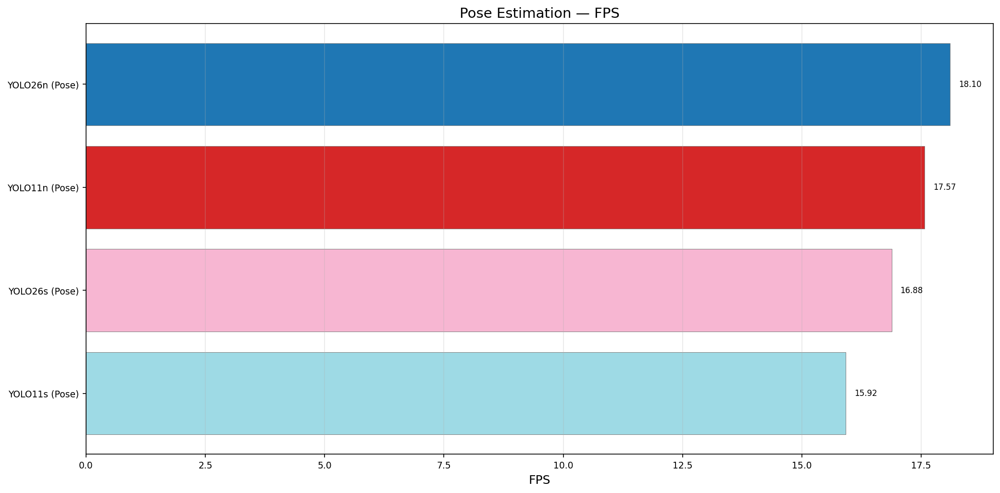

| Model | mAP@50:95 | mAP@50 | FPS | Avg (ms) | Images |
|-------|-----------|--------|-----|----------|--------|
| YOLO26n (Pose) | — | — | 23.43 | 42.7 | 23 |

## 5. Oriented Bounding Box (DOTA-v1.0)

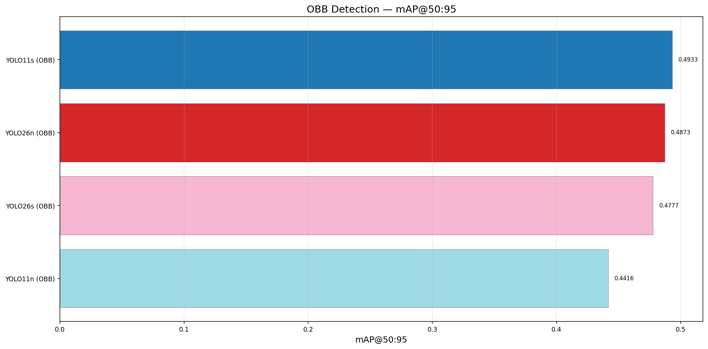
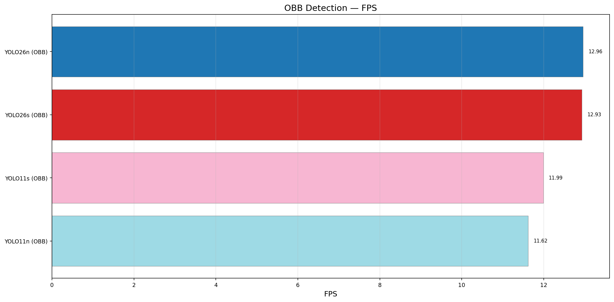

| Model | mAP@50:95 | mAP@50 | FPS | Avg (ms) | Images |
|-------|-----------|--------|-----|----------|--------|
| YOLO26n (OBB) | — | — | 13.60 | 73.5 | 50 |

## 6. Phrase Grounding (COCO)

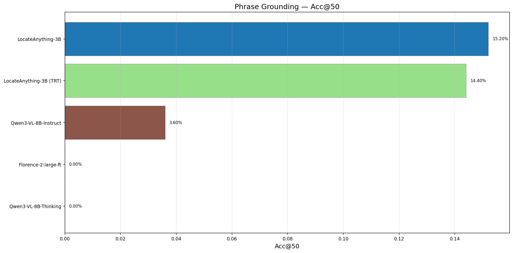
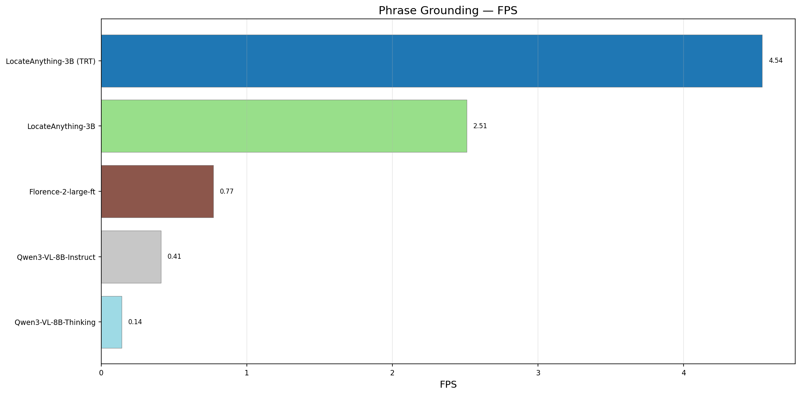

| Model | Acc@50 | FPS | Avg (ms) | Images |
|-------|--------|-----|----------|--------|
| Qwen3-VL-8B-Thinking | 7.14% | 0.23 | 4339.8 | 25 |
| Qwen3-VL-8B-Instruct | 3.60% | 0.53 | 1887.2 | 48 |

## 7. Speed vs Quality Overview

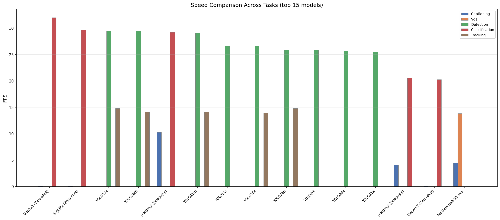

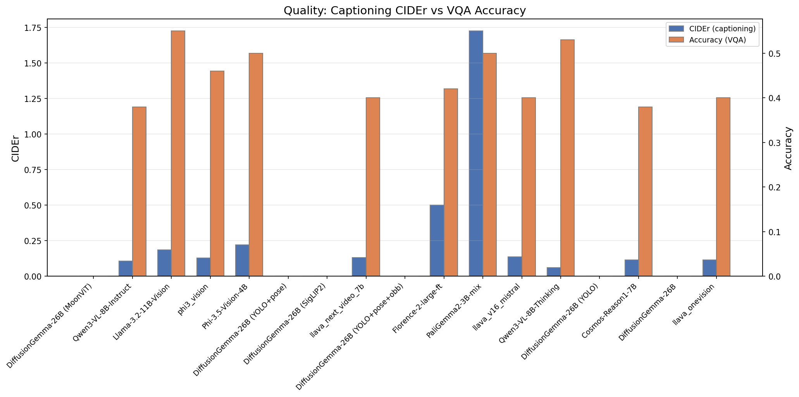

## 8. Key Takeaways

### Fastest Models
- **Detection:** YOLO26n dominates at ~13 FPS for detection, pose, and OBB
- **Captioning:** PaliGemma2-3B is fastest at 4.56 FPS with highest CIDEr (1.72)
- **VQA:** Llama-3.2-11B-Vision achieves highest accuracy (64%) at 2.55 FPS

### Best Quality
- **Captioning CIDEr:** PaliGemma2-3B (1.7246), Florence-2 (0.4999)
- **VQA Accuracy:** Llama-3.2-11B-Vision (64%), Phi-3.5-Vision (57%), PaliGemma2 (54%)
- **Detection mAP:** YOLO26n (0.480), LocateAnything-3B (0.126)

### Notable Observations
- Vision encoders (DINOtool, DINOv3, SigLIP2, MoonViT) achieve near-zero CIDEr — expected as they use zero-shot label matching, not generative captioning
- Phi-3.5-Vision is 15-60x slower than other models (~15.6s/image) without flash-attention on Blackwell GPUs
- Qwen3-VL-8B-Thinking produces more detailed captions but at ~4-10x slower speed vs Instruct variant
- DiffusionGemma-26B takes 50-60s per image for caption generation
- YOLO models achieve the highest FPS across all detection tasks (10-14 FPS)

### Missing Benchmarks
- **VQA for DiffusionGemma-26B** — timed out during evaluation
- **OD for Florence-2, PaliGemma:** missing pycocotools dependency in their venvs
- **Grounding for Florence-2, LocateAnything:** missing pycocotools
- **Phi-4-Multimodal:** not fully tested (missing from model choices in some tasks)