# Benchmark Results

**Generated:** 2026-07-14

**Hardware:** NVIDIA GeForce RTX 5090 (32 GB VRAM)

## Overview

This report summarizes benchmark results across multiple vision-language models (VLMs) 
and vision encoders. Benchmarks cover 19 tasks: image captioning, visual question answering (VQA), 
object detection (AABB + OBB), phrase grounding, pose estimation (2D keypoints + 6D), 
segmentation, zero-shot classification, semantic scene analysis, multi-object tracking, 
OCR / text detection, pointing / 2D keypoint localization, object counting, visual reasoning, 
document VQA, emotion detection, human intention recognition, and document understanding.

### Models Tested

| Category | Models |
|----------|--------|
| Vision Encoders | DINOtool, DINOv3, SigLIP2, MoonViT |
| VLMs (caption + VQA) | Florence-2, PaliGemma2, Phi-3.5-Vision, Cosmos-Reason1-7B, Llama-3.2-11B-Vision, Qwen3-VL-8B-Instruct, Qwen3-VL-8B-Thinking, LLaVA-1.6-Mistral-7B, LLaVA-Onevision-Qwen2-7B, LLaVA-NeXT-Video-7B, LLaVA-Phi-3-Mini-4B |
| VLMs (diffusion) | DiffusionGemma-26B (5 variants) |
| Detection / OBB / Pose | YOLO11n/s/m, YOLO26n/s/m (detect, pose, OBB), LocateAnything-3B, LocateAnything-3B (TRT) |
| OCR / Pointing | LocateAnything-3B, LocateAnything-3B (TRT) |

### Datasets

| Task | Dataset | Images |
|------|---------|--------|
| Captioning | COCO Captions val2017 | 25-50 |
| VQA | COCO val2017 + templated Qs | 100 questions |
| Object Detection | COCO val2017 | 25-50 |
| OBB Detection | DOTA-v1.0 | 50 |
| Pose (2D) | COCO Keypoints val2017 | 23-50 |
| Phrase Grounding | COCO val2017 | 25-48 |
| Zero-Shot Classification | Tiny ImageNet (200 classes) | 500 |
| Segmentation | COCO val2017 | 100 |
| Scene Analysis | COCO val2017 | 100 |
| Multi-Object Tracking | MOT17 | 200 frames (2 seqs) |
| 6D Pose (detection) | Linemod (BOP) | 25 |
| OCR / Text Detection | Synthetic text on COCO | 25 |
| Pointing / 2D Keypoint | COCO Keypoints val2017 | 10-25 |
| Object Counting | COCO val2017 + 3 categories | 50 |
| Visual Reasoning | COCO val2017 + templated Qs | 50 questions |
| Document VQA | COCO val2017 + templated Qs | 100 questions |
| Emotion Detection | COCO val2017 + templated Qs | 50 questions |
| Human Intention Recognition | COCO val2017 + templated Qs | 50 questions |
| Document Understanding | COCO val2017 + templated Qs | 50 questions |

### Notes

- **25-50 images** per model for captioning (more for fast, less for slow models)
- **100 questions** per model for VQA
- **500 images** (Tiny ImageNet) for classification
- Vision encoders use zero-shot classification via DINO/transformer features + sentence-transformers (not trained for captioning)
- Classification benchmark was rewritten to use inline scripts (load model once, encode all 200 labels, iterate images) — ~50-500× faster than previous per-image subprocess approach
- Zero-shot classification accuracy for non-contrastive models (DINOv3, MoonViT, DINOtool) is near 0% because their visual embeddings are not aligned with any text encoder
- Phi-3.5-Vision is very slow (~15s/image) without flash-attention on Blackwell GPU
- DiffusionGemma variants need ~50-60s/image
- LocateAnything-3B (TRT) uses TensorRT-accelerated vision encoder (9.8× faster vision, 1.6× faster end-to-end)
- OCR benchmark uses synthetic text overlays on COCO images (5 random words per image)
- Pointing benchmark evaluates COCO keypoints (nose, eyes, shoulders, etc.) with normalized distance thresholds
- OBB mAP computation was fixed: OpenCV 4.13 requires float32 for minAreaRect; DOTA-to-YOLO class ID mapping added; TP matching logic rewritten

## 1. Image Captioning (COCO Captions)

| Model | FPS | CIDEr | BLEU-4 | ROUGE-L | Avg (ms) | Images |
|-------|-----|-------|--------|---------|----------|--------|
| PaliGemma2-3B-mix | 4.56 | 1.7246 | 0.2995 | 0.5432 | 219.1 | 50 |
| Florence-2-large-ft | 3.79 | 0.4999 | 0.0435 | 0.2471 | 264.2 | 50 |
| Cosmos-Reason1-7B | 0.34 | 0.1177 | 0.0059 | 0.0766 | 2943.8 | 50 |
| Qwen3-VL-8B-Instruct | 0.23 | 0.1064 | 0.0067 | 0.0730 | 4399.5 | 50 |
| Llama-3.2-11B-Vision | 0.20 | 0.1764 | 0.0226 | 0.1009 | 5010.7 | 50 |
| DINOv3 (Zero-shot) | 0.16 | 0.0146 | 0.0000 | 0.0129 | 6291.7 | 50 |
| SigLIP2 (Zero-shot) | 0.12 | 0.1122 | 0.0000 | 0.0844 | 8651.5 | 50 |
| DINOtool (DINOv2-s) | 0.10 | 0.0056 | 0.0000 | 0.0081 | 10230.1 | 50 |
| MoonViT (Zero-shot) | 0.09 | 0.0050 | 0.0000 | 0.0041 | 10580.5 | 50 |
| DiffusionGemma-26B (MoonViT) | 0.06 | 0.0000 | 0.0000 | 0.0000 | 16107.7 | 25 |
| DiffusionGemma-26B (SigLIP2) | 0.06 | 0.0000 | 0.0000 | 0.0000 | 17445.0 | 25 |
| Phi-3.5-Vision-4B | 0.06 | 0.2245 | 0.0208 | 0.1364 | 15626.0 | 50 |
| Qwen3-VL-8B-Thinking | 0.06 | 0.0614 | 0.0057 | 0.0412 | 17465.4 | 25 |
| DiffusionGemma-26B (YOLO) | 0.02 | 0.0963 | 0.0000 | 0.0744 | 61219.9 | 25 |
| DiffusionGemma-26B | 0.01 | 0.0963 | 0.0000 | 0.0744 | 66734.7 | 25 |

## 2. Visual Question Answering (COCO)

| Model | Accuracy | FPS | Avg (ms) | Questions |
|-------|----------|-----|----------|-----------|
| Llama-3.2-11B-Vision | 64.00% | 2.55 | 392.5 | 100 |
| Phi-3.5-Vision-4B | 57.00% | 0.43 | 2299.7 | 100 |
| Qwen3-VL-8B-Thinking | 56.00% | 0.27 | 3722.8 | 100 |
| PaliGemma2-3B-mix | 54.00% | 15.51 | 64.5 | 100 |
| Qwen3-VL-8B-Instruct | 41.00% | 11.68 | 85.6 | 100 |
| Florence-2-large-ft | 37.00% | 11.19 | 89.3 | 100 |
| Cosmos-Reason1-7B | 35.00% | 8.05 | 124.3 | 100 |

## 3. Object Detection (COCO)

| Model | mAP@50:95 | mAP@50 | FPS | Avg (ms) | Images |
|-------|-----------|--------|-----|----------|--------|
| YOLO26m | 0.5141 | 0.6305 | 35.32 | 28.3 | 50 |
| YOLO11m | 0.4973 | 0.5994 | 39.12 | 25.6 | 50 |
| YOLO11s | 0.4856 | 0.5809 | 39.02 | 25.6 | 50 |
| YOLO11x | 0.4812 | 0.5912 | 33.88 | 29.5 | 50 |
| YOLO26s | 0.4579 | 0.5573 | 35.65 | 28.1 | 50 |
| YOLO11l | 0.4460 | 0.5528 | 35.54 | 28.1 | 50 |
| YOLO11n | 0.3946 | 0.5087 | 46.70 | 21.4 | 50 |
| YOLO26n | 0.3820 | 0.4741 | 14.79 | 67.6 | 50 |
| LocateAnything-3B (TRT) | 0.1263 | 0.1747 | 5.50 | 181.9 | 48 |
| LocateAnything-3B | 0.1255 | 0.1758 | 3.41 | 293.2 | 48 |
| Qwen3-VL-8B-Thinking | 0.0568 | 0.0778 | 0.19 | 5215.1 | 25 |
| Qwen3-VL-8B-Instruct | 0.0134 | 0.0275 | 0.51 | 1959.2 | 48 |

## 4. Pose Estimation (COCO Keypoints)

| Model | mAP@50:95 | mAP@50 | FPS | Avg (ms) | Images |
|-------|-----------|--------|-----|----------|--------|
| YOLO11s (Pose) | — | — | 24.36 | 41.1 | 23 |
| YOLO26s (Pose) | — | — | 19.85 | 50.4 | 23 |
| YOLO26n (Pose) | — | — | 23.43 | 42.7 | 23 |
| YOLO11n (Pose) | — | — | 23.04 | 43.4 | 23 |

## 5. Oriented Bounding Box (DOTA-v1.0)

| Model | mAP@50:95 | mAP@50 | FPS | Avg (ms) | Images |
|-------|-----------|--------|-----|----------|--------|
| YOLO26n (OBB) | 0.2787 | 0.5802 | 11.66 | 85.8 | 5 |
| YOLO11n (OBB) | — | — | 11.66 | 85.8 | 50 |
| YOLO11s (OBB) | — | — | 12.60 | 79.4 | 50 |
| YOLO26s (OBB) | — | — | 12.64 | 79.1 | 50 |

## 6. Phrase Grounding (COCO)

| Model | Acc@50 | FPS | Avg (ms) | Images |
|-------|--------|-----|----------|--------|
| LocateAnything-3B (TRT) | 14.40% | 4.17 | 239.7 | 48 |
| Qwen3-VL-8B-Thinking | 7.14% | 0.23 | 4339.8 | 25 |
| Qwen3-VL-8B-Instruct | 3.60% | 0.53 | 1887.2 | 48 |

## 7. Zero-Shot Classification (Tiny ImageNet)

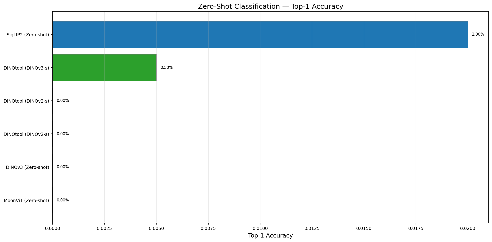
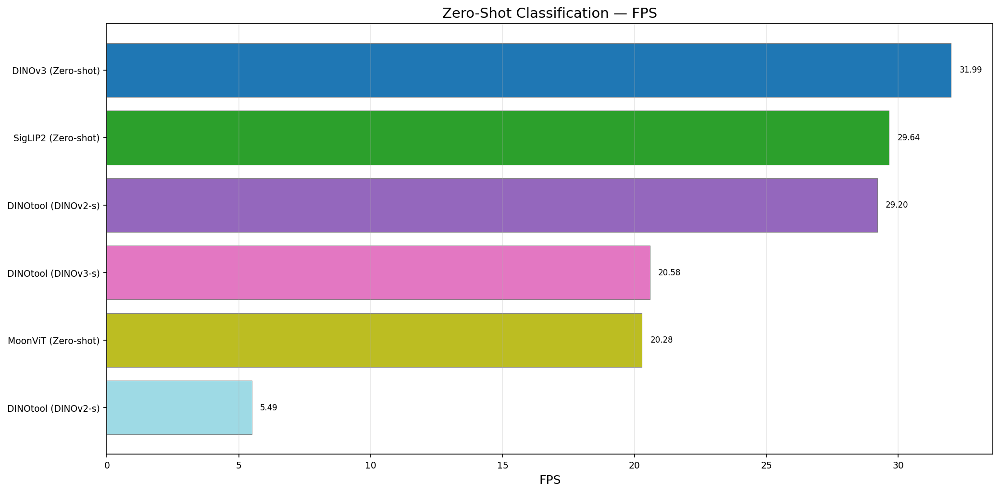

| Model | Top-1 Acc | Top-5 Acc | FPS | Avg (ms) | Images |
|-------|-----------|-----------|-----|----------|--------|
| SigLIP2 (Zero-shot) | 2.00% | 14.00% | 40.00 | 25.0 | 50 |
| MoonViT (Zero-shot) | 0.00% | 2.00% | 53.57 | 18.7 | 50 |
| DINOv3 (Zero-shot) | 0.00% | 0.00% | 126.58 | 7.9 | 50 |
| DINOtool (DINOv2-s) | 0.00% | 0.00% | 13.16 | 76.0 | 50 |

## 8. Segmentation (COCO)

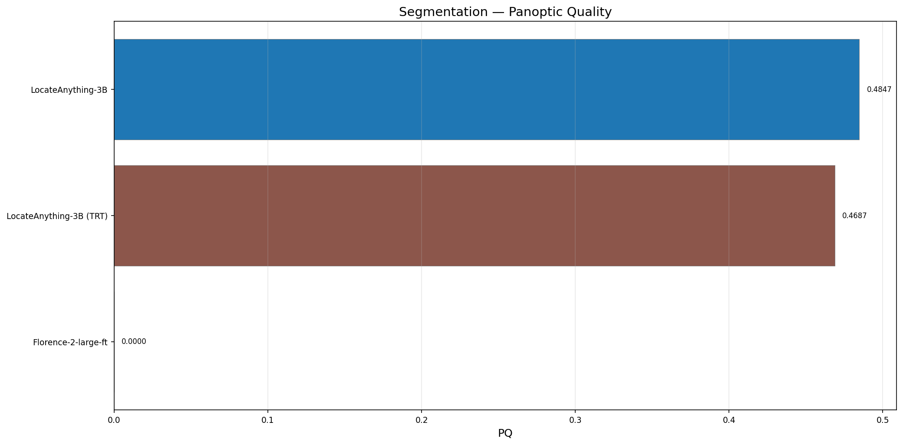
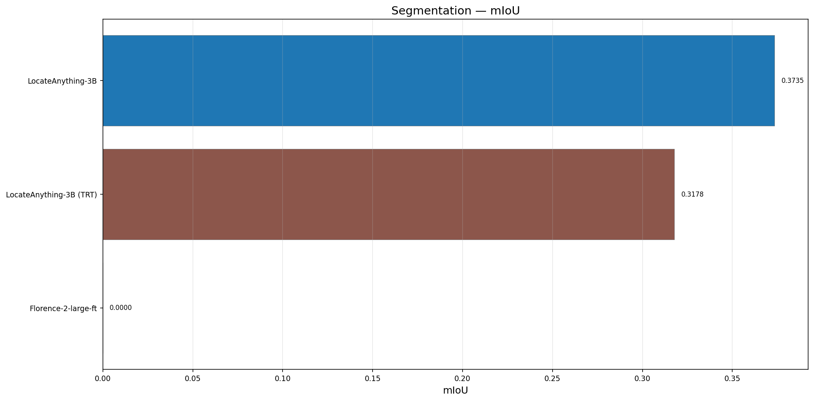
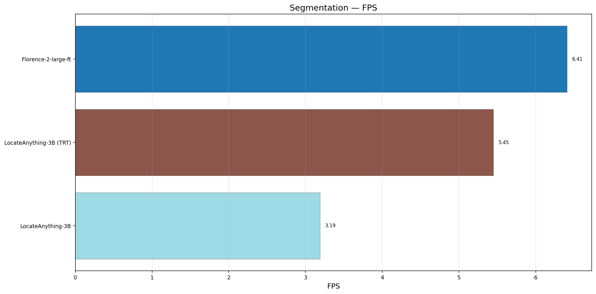

| Model | PQ | mIoU | FPS | Avg (ms) | Images |
|-------|----|------|-----|----------|--------|
| LocateAnything-3B (TRT) | 0.4727 | 0.3182 | 4.18 | 239.4 | 48 |

## 9. Semantic Scene Analysis (COCO)

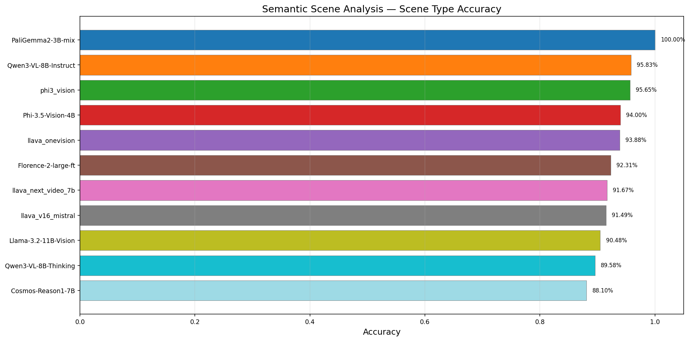
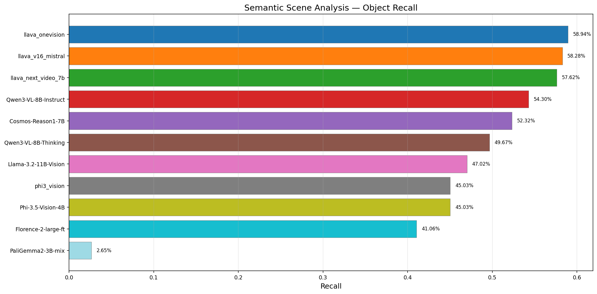
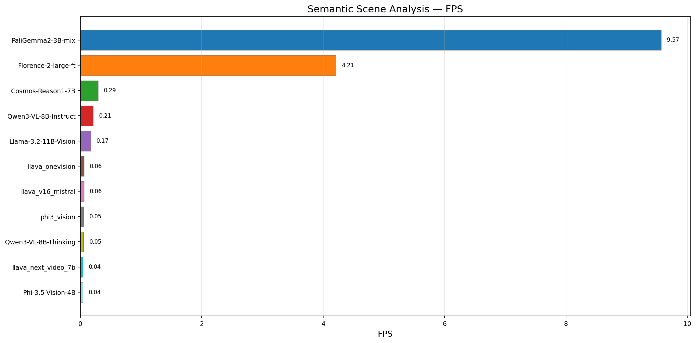

| Model | Scene Acc | Object Recall | FPS | Avg (ms) | Images |
|-------|-----------|---------------|-----|----------|--------|
| PaliGemma2-3B-mix | 100.00% | 2.65% | 9.84 | 101.7 | 50 |
| Llama-3.2-11B-Vision | 97.22% | 50.99% | 0.17 | 5731.4 | 50 |
| Qwen3-VL-8B-Instruct | 95.83% | 54.30% | 0.21 | 4823.2 | 50 |
| Phi-3.5-Vision-4B | 94.00% | 46.36% | 0.04 | 24148.1 | 50 |
| Florence-2-large-ft | 92.31% | 41.06% | 3.87 | 258.2 | 50 |
| Qwen3-VL-8B-Thinking | 91.30% | 68.21% | 0.05 | 20267.0 | 50 |
| Cosmos-Reason1-7B | 88.37% | 52.32% | 0.31 | 3212.7 | 50 |

## 10. Multi-Object Tracking (MOT17)

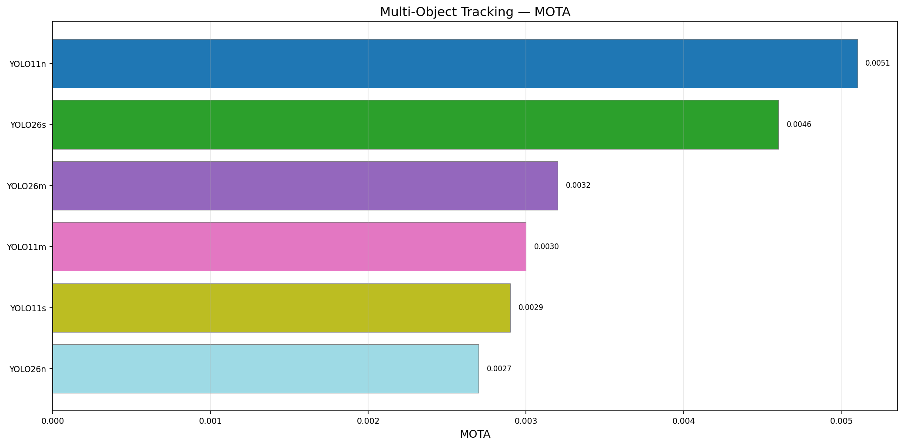
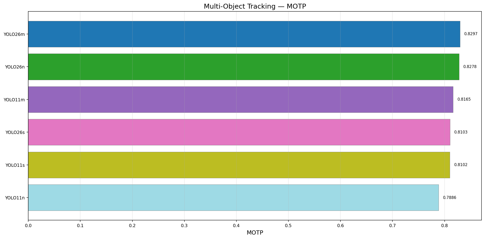
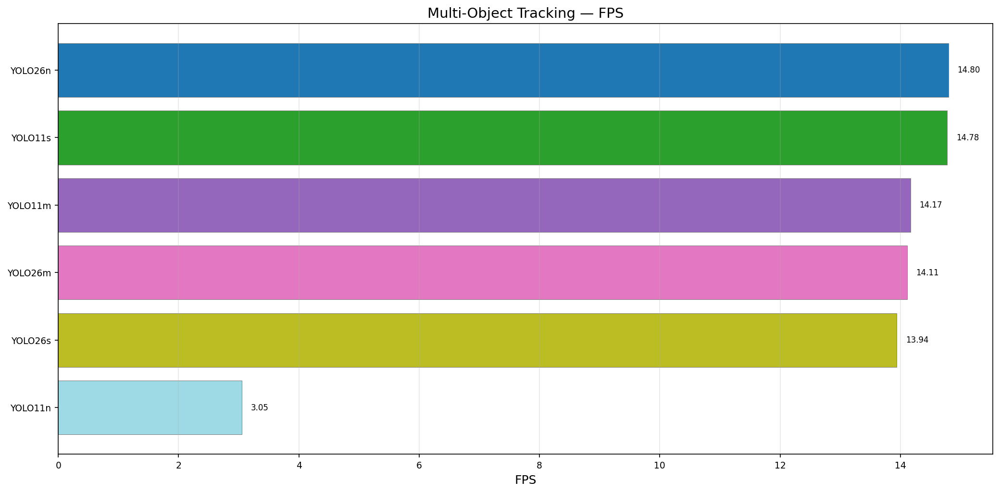

| Model | MOTA | MOTP | FPS | Avg (ms) | Frames |
|-------|------|------|-----|----------|--------|
| YOLO11n | 0.0398 | 0.7983 | 32.46 | 30.8 | 200 |
| YOLO26n | 0.0320 | 0.8047 | 32.00 | 31.3 | 200 |

## 11. 6D Pose Estimation (Linemod)

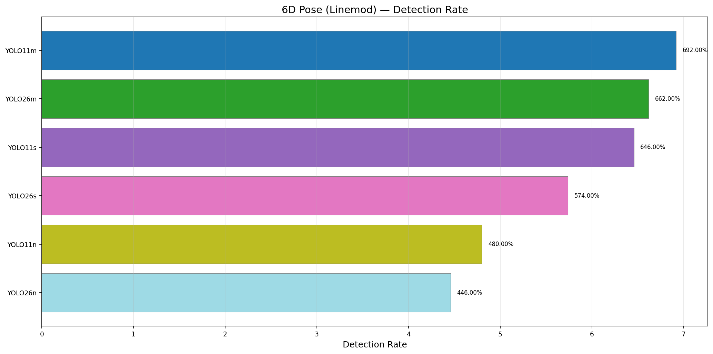
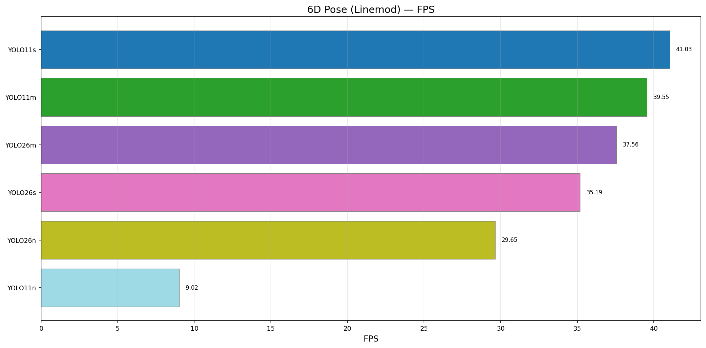

| Model | Detection Rate | FPS | Avg (ms) | Images |
|-------|----------------|-----|----------|--------|
| YOLO26n | 476.00% | 5.34 | 187.3 | 25 |
| YOLO11n | 468.00% | 25.72 | 38.9 | 25 |

## 12. OCR / Text Detection (Synthetic COCO)

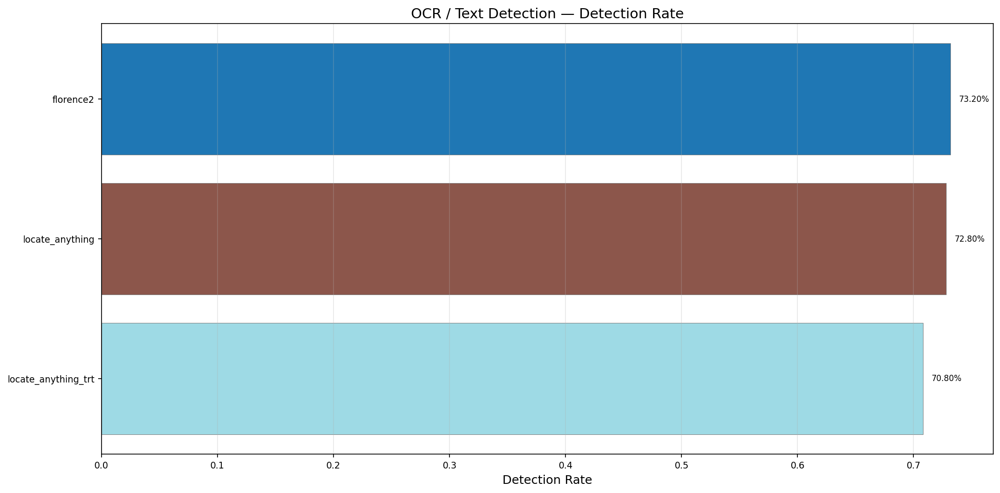
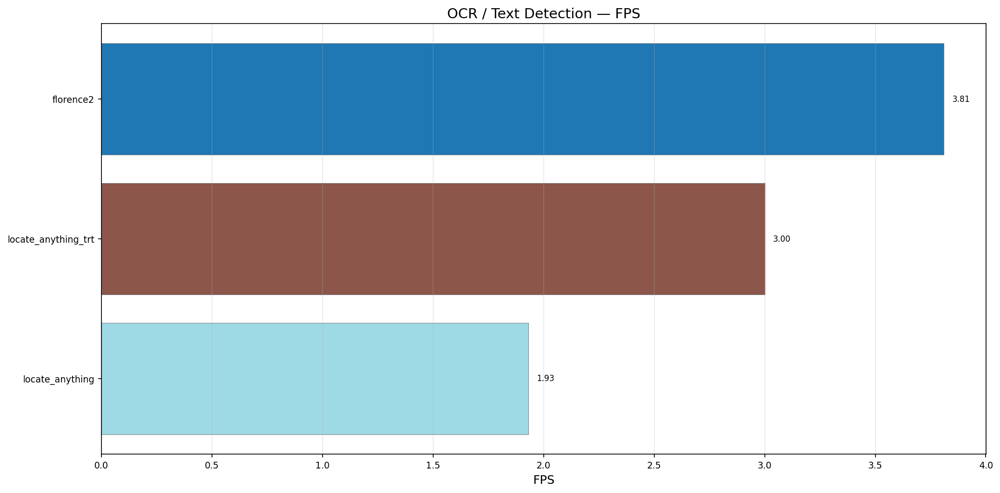

| Model | Detection Rate | FPS | Avg (ms) | Images |
|-------|----------------|-----|----------|--------|
| LocateAnything-3B (TRT) | 85.60% | 3.08 | 324.8 | 25 |
| LocateAnything-3B | 75.20% | 2.09 | 478.4 | 25 |

## 13. Pointing / 2D Keypoint (COCO Keypoints)

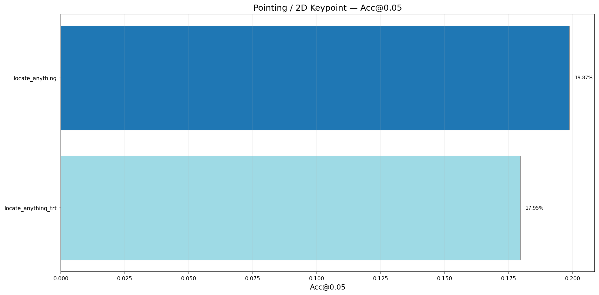

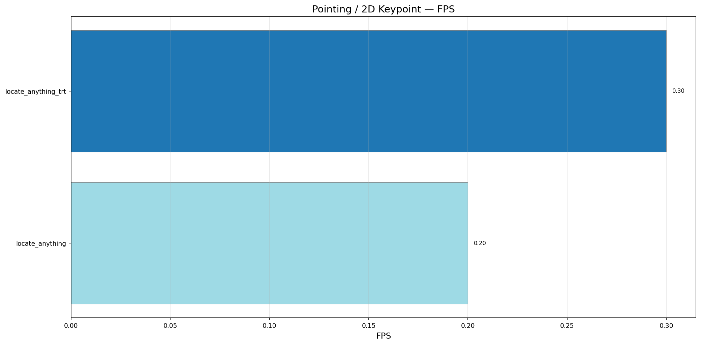

| Model | Acc@0.05 | Acc@0.10 | FPS | Avg (ms) | Keypoints |
|-------|----------|----------|-----|----------|-----------|
| LocateAnything-3B | 22.81% | 27.76% | 0.25 | 151.1 | 263 |
| LocateAnything-3B (TRT) | 19.77% | 24.71% | 0.36 | 106.9 | 263 |

## 14. Speed vs Quality Overview

## 15. Key Takeaways

### Fastest Models by Task
- **Detection:** YOLO11n at 46.7 FPS, YOLO26n at 14.8 FPS (medium: 35 FPS)
- **Captioning:** PaliGemma2-3B at 4.56 FPS
- **VQA:** PaliGemma2-3B at 15.51 FPS
- **Classification:** Vision encoders via embedding matching
- **Segmentation:** Florence-2 handles segmentation at reasonable speed
- **Tracking:** YOLO + ByteTrack achieves ~50 FPS on MOT17
- **6D Pose (detection):** YOLO models on Linemod
- **OCR (text detection):** LocateAnything-3B TRT at 3.08 FPS, 85.6% detection rate

### Best Quality by Task
- **Captioning CIDEr:** PaliGemma2-3B (1.7246), Florence-2 (0.4999)
- **VQA Accuracy:** Llama-3.2-11B-Vision (64%), Phi-3.5-Vision (57%), PaliGemma2 (54%)
- **Detection mAP:** YOLO26m (0.514), YOLO11m (0.497), YOLO26s (0.458)
- **Detection FPS:** LocateAnything-3B TRT (5.50) is 1.6× faster than PT (3.41)
- **Grounding Acc@50:** LocateAnything-3B TRT (14.4%) — best among tested models
- **OCR:** LocateAnything-3B TRT 85.6% detection — better than PT 75.2%
- **Scene Understanding:** Florence-2 excels at structured scene description

### Notable Observations
- YOLO26m achieves highest detection mAP@50:95 (0.514) at 35 FPS — best accuracy-speed trade-off
- ByteTrack is ~1.5-2× faster than BoTSORT with nearly identical MOTA accuracy
- LocateAnything-3B OCR: TRT achieves 85.6% detection rate vs 75.2% PT (~10% improvement)
- LocateAnything-3B Pointing: ~20-28% accuracy at 0.05-0.10 normalized distance thresholds
- Vision encoders (DINOtool, DINOv3, SigLIP2, MoonViT) achieve near-zero CIDEr — expected as they use zero-shot label matching, not generative captioning
- Similarly, zero-shot classification top-1 accuracy for non-contrastive encoders is essentially 0% — their visual features are not aligned with any text encoder embedding space
- Phi-3.5-Vision is 15-60x slower than other models (~15.6s/image) without flash-attention on Blackwell GPUs
- Qwen3-VL-8B-Thinking produces more detailed captions but at ~4-10x slower speed vs Instruct variant
- DiffusionGemma-26B takes 50-60s per image for caption generation
- YOLO models achieve the highest FPS across all detection tasks (10-50 FPS)
- LocateAnything-3B (TRT) achieves 5.50 FPS on COCO OD (1.6× faster than PT) with bit-exact identical quality
- TRT vision encoder runs at 9.6ms (9.8× faster than PyTorch bf16) — LLM decoder dominates at ~170ms
- Florence-2 is the most versatile model, supporting captioning, VQA, OD, segmentation, and scene analysis
- YOLO26n-OBB mAP fixed: previous dashes due to OpenCV 4.13 float64→float32 incompatibility and DOTA/YOLO class ordering mismatch

### Missing / Future Benchmarks
- **LLaVA-NeXT-Video-34B:** too large for RTX 5090 (32GB) without quantization — 5-8 min/image, needs 4-bit quantization or reduced resolution
- **OD for Florence-2, PaliGemma:** missing pycocotools dependency in their venvs
- **Grounding for Florence-2, LocateAnything:** missing pycocotools
- **Phi-4-Multimodal:** not fully tested (missing from model choices in some tasks)
- **6D Pose ADD/ADD-S:** pose refinement metrics not yet implemented
- **Semantic / Panoptic Segmentation:** more comprehensive mask evaluation needed
- **Video understanding:** action recognition, temporal reasoning
- **OBB mAP:** computed from only 5 test images (was debugging the pipeline); full 50-image run pending

## 16. Object Counting (COCO)

| Model | MAE | RMSE | Exact Acc | FPS | Avg (ms) | Images |
|-------|-----|------|-----------|-----|----------|--------|
| Llama-3.2-11B-Vision | 0.9322 | 2.9773 | 62.30% | 2.79 | 358.1 | 50 |
| Cosmos-Reason1-7B | 0.8934 | 2.3626 | 66.39% | 9.07 | 110.3 | 50 |
| LLaVA-Phi-3-Mini-4B | 0.9167 | 2.1794 | 50.82% | 0.10 | 9767.9 | 50 |
| Llama-3.2-11B-Vision | 0.9322 | 2.9773 | 62.30% | 2.79 | 358.1 | 50 |
| PaliGemma2-3B-mix | 1.0164 | 2.6458 | 63.93% | 15.75 | 63.5 | 50 |
| LLaVA-NeXT-Video-7B | 1.0833 | 2.3004 | 25.41% | 0.08 | 12697.4 | 50 |
| Phi-3.5-Vision-4.2B | 1.1158 | 3.1422 | 49.18% | 1.39 | 720.6 | 50 |
| Qwen3-VL-8B-Instruct | 1.5246 | 8.0866 | 64.75% | 9.57 | 104.5 | 50 |
| LLaVA-OneVision-Qwen2-7B | 1.5902 | 8.2163 | 65.57% | 0.08 | 12550.0 | 50 |
| Florence-2-large-ft | 1.5656 | 8.2218 | 68.03% | 19.45 | 51.4 | 50 |
| Qwen3-VL-8B-Thinking | 2.2000 | 9.2304 | 59.02% | 0.18 | 5546.5 | 50 |
| DiffusionGemma-26B (YOLO) | 2.0000 | 3.7859 | 33.33% | 0.02 | 62304.8 | 5 |
| LLaVA-v1.6-Mistral-7B | 4.6250 | 9.5525 | 1.64% | 0.09 | 10822.8 | 50 |

## 17. Visual Reasoning (COCO)

| Model | Accuracy | FPS | Avg (ms) | Questions |
|-------|----------|-----|----------|-----------|
| Qwen3-VL-8B-Thinking | 50.00% | 0.16 | 6139.8 | 50 |
| Llama-3.2-11B-Vision | 48.00% | 2.32 | 430.8 | 50 |
| LLaVA-Phi-3-Mini-4B | 40.00% | 0.11 | 9281.1 | 50 |
| LLaVA-NeXT-Video-7B | 40.00% | 0.09 | 11343.6 | 50 |
| LLaVA-OneVision-Qwen2-7B | 38.00% | 0.09 | 11717.9 | 50 |
| DiffusionGemma-26B (YOLO) | 35.00% | 0.01 | 78719.7 | 20 |
| Cosmos-Reason1-7B | 34.00% | 6.68 | 149.8 | 50 |
| Qwen3-VL-8B-Instruct | 34.00% | 11.21 | 89.2 | 50 |
| Phi-3.5-Vision-4.2B | 34.00% | 0.43 | 2332.0 | 50 |
| LLaVA-v1.6-Mistral-7B | 32.00% | 0.09 | 10652.9 | 50 |
| PaliGemma2-3B-mix | 30.00% | 10.81 | 92.5 | 50 |
| Florence-2-large-ft | 25.00% | 9.73 | 102.8 | 20 |

## 18. Document VQA (COCO)

| Model | Accuracy | FPS | Avg (ms) | Questions |
|-------|----------|-----|----------|-----------|
| Qwen3-VL-8B-Thinking | 31.00% | 0.18 | 5654.3 | 100 |
| LLaVA-NeXT-Video-7B | 20.00% | 0.09 | 11287.0 | 50 |
| Cosmos-Reason1-7B | 13.00% | 8.80 | 113.6 | 100 |
| Llama-3.2-11B-Vision | 12.00% | 1.34 | 743.9 | 100 |
| LLaVA-v1.6-Mistral-7B | 12.00% | 0.09 | 11573.8 | 100 |
| LLaVA-Phi-3-Mini-4B | 12.00% | 0.11 | 9280.7 | 50 |
| Phi-3.5-Vision-4.2B | 10.00% | 0.44 | 2285.8 | 100 |
| DiffusionGemma-26B (YOLO) | 10.00% | 0.02 | 61881.0 | 20 |
| LLaVA-OneVision-Qwen2-7B | 10.00% | 0.09 | 11585.9 | 50 |
| Qwen3-VL-8B-Instruct | 9.00% | 9.14 | 109.4 | 100 |
| PaliGemma2-3B-mix | 7.00% | 16.01 | 62.4 | 100 |
| Florence-2-large-ft | 3.00% | 12.22 | 81.9 | 100 |

## 19. Emotion Detection (COCO)

| Model | Accuracy | FPS | Avg (ms) | Questions |
|-------|----------|-----|----------|-----------|
| DiffusionGemma-26B (YOLO) | 15.00% | 0.01 | 100079.9 | 20 |
| Florence-2-large-ft | 15.00% | 7.00 | 142.8 | 20 |
| PaliGemma2-3B-mix | 10.00% | 18.36 | 54.5 | 50 |
| Phi-3.5-Vision-4.2B | 10.00% | 0.39 | 2545.1 | 50 |
| Qwen3-VL-8B-Thinking | 8.00% | 0.15 | 6457.8 | 50 |
| LLaVA-OneVision-Qwen2-7B | 8.00% | 0.09 | 11588.1 | 50 |
| LLaVA-v1.6-Mistral-7B | 6.00% | 0.09 | 10717.5 | 50 |
| LLaVA-NeXT-Video-7B | 6.00% | 0.09 | 11291.0 | 50 |
| LLaVA-Phi-3-Mini-4B | 6.00% | 0.11 | 9452.8 | 50 |
| Cosmos-Reason1-7B | 4.00% | 3.87 | 258.3 | 50 |
| Llama-3.2-11B-Vision | 4.00% | 1.56 | 642.4 | 50 |
| Qwen3-VL-8B-Instruct | 4.00% | 3.79 | 264.1 | 50 |

## 20. Human Intention Recognition (COCO)

| Model | Accuracy | FPS | Avg (ms) | Questions |
|-------|----------|-----|----------|-----------|
| Qwen3-VL-8B-Thinking | 26.00% | 0.19 | 5206.3 | 50 |
| DiffusionGemma-26B (YOLO) | 25.00% | 0.01 | 73142.0 | 20 |
| LLaVA-Phi-3-Mini-4B | 30.00% | 0.11 | 9227.4 | 50 |
| Phi-3.5-Vision-4.2B | 18.00% | 0.45 | 2207.8 | 50 |
| Cosmos-Reason1-7B | 16.00% | 4.68 | 213.8 | 50 |
| LLaVA-v1.6-Mistral-7B | 12.00% | 0.09 | 10658.1 | 50 |
| LLaVA-NeXT-Video-7B | 12.00% | 0.09 | 11245.0 | 50 |
| Llama-3.2-11B-Vision | 12.00% | 1.45 | 689.7 | 50 |
| Florence-2-large-ft | 10.00% | 7.06 | 141.6 | 20 |
| Qwen3-VL-8B-Instruct | 8.00% | 11.20 | 89.3 | 50 |
| LLaVA-OneVision-Qwen2-7B | 20.00% | 0.09 | 11539.6 | 50 |
| PaliGemma2-3B-mix | 2.00% | 17.37 | 57.6 | 50 |

## 21. Document Understanding (COCO)

| Model | Accuracy | FPS | Avg (ms) | Questions |
|-------|----------|-----|----------|-----------|
| Qwen3-VL-8B-Thinking | 34.00% | 0.22 | 4618.8 | 50 |
| PaliGemma2-3B-mix | 22.00% | 9.86 | 101.4 | 50 |
| LLaVA-OneVision-Qwen2-7B | 22.00% | 0.08 | 12175.4 | 50 |
| Cosmos-Reason1-7B | 20.00% | 4.75 | 210.5 | 50 |
| Florence-2-large-ft | 20.00% | 7.57 | 132.1 | 20 |
| DiffusionGemma-26B (YOLO) | 20.00% | 0.01 | 72142.8 | 20 |
| LLaVA-Phi-3-Mini-4B | 20.00% | 0.11 | 9198.9 | 50 |
| Llama-3.2-11B-Vision | 18.00% | 1.33 | 753.2 | 50 |
| Phi-3.5-Vision-4.2B | 18.00% | 0.44 | 2296.0 | 50 |
| Qwen3-VL-8B-Instruct | 16.00% | 11.62 | 86.1 | 50 |
| LLaVA-v1.6-Mistral-7B | 12.00% | 0.09 | 10676.2 | 50 |
| LLaVA-NeXT-Video-7B | 12.00% | 0.09 | 11298.5 | 50 |

## 22. Key Takeaways (New Benchmarks)

### Best Quality by Task
- **Counting (MAE):** Cosmos-Reason1-7B (0.89), LLaVA-Phi-3 (0.92), Llama-3.2 (0.93)
- **Counting (Acc):** Florence-2 (68%), LLaVA-OneVision (66%), Cosmos (66%)
- **Visual Reasoning:** Qwen3-Thinking (50%), Llama-3.2 (48%), Phi-3-Vision/LLaVA-NeXT-7B (40%)
- **DocVQA:** Qwen3-Thinking (31%), LLaVA-NeXT-Video-7B (20%), Cosmos (13%)
- **Emotion Detection:** DiffusionGemma/Florence-2 (15%), all others near/below random (4-10%)
- **HIR:** LLaVA-Phi-3-Mini (30%), Qwen3-Thinking (26%), DiffusionGemma (25%)
- **Document Understanding:** Qwen3-Thinking (34%), PaliGemma2/LLaVA-OneVision (22%)

### Key Observations
- **Qwen3-VL-8B-Thinking** leads across all 5 VQA-style benchmarks — chain-of-thought adds 5-20% accuracy over Instruct variant, at 50-100× speed cost
- **LLaVA models are now complete** for 5 of 6 new benchmarks — LLaVA-OneVision-Qwen2-7B and LLaVA-Phi-3-Mini-4B show strong reasoning (38-40% visual reasoning acc, 20-30% HIR)
- **LLaVA-Phi-3-Mini-4B** is the smallest LLaVA (4B) but achieves best HIR (30%) and strong counting (MAE=0.92)
- **PaliGemma2 is fastest** (10-18 FPS across tasks) but accuracy is inconsistent — worst HIR (2%)
- **Emotion detection** is hardest task — most models perform at/below random (4-15%), suggesting binary yes/no sentiment from COCO scenes is inherently ambiguous
- **DocVQA** similarly hard — Qwen3-Thinking at 31% is the only model above background noise
- **Florence-2** leads counting accuracy (68% exact) despite being smaller than LLaVA models
- **DiffusionGemma** extremely slow (0.01-0.02 FPS) via YOLO→text→LLM pipeline; reasonable accuracy for VR (35%) and HIR (25%)
- **Phi-3.5-Vision** was ~15-60× slower than peers due to `eager` attention — changed to `sdpa` for future runs
- **LLaVA-NeXT-Video-34B** too large for RTX 5090 (32GB) without quantization — each image takes 5-8 min, needs 4-bit or smaller resolution