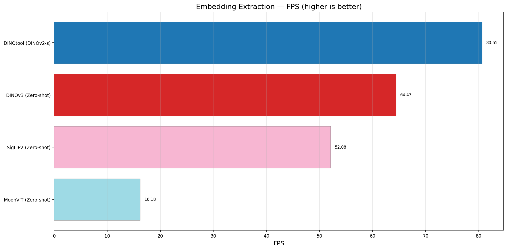
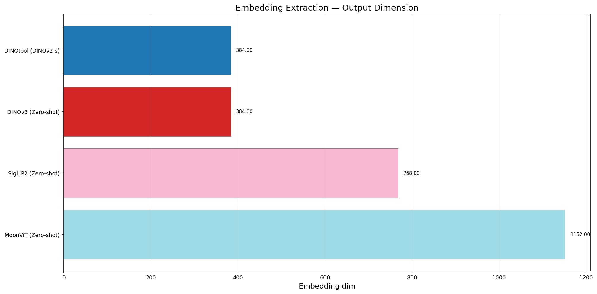
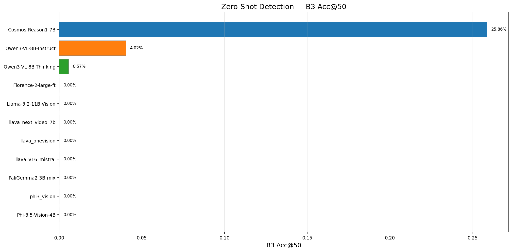
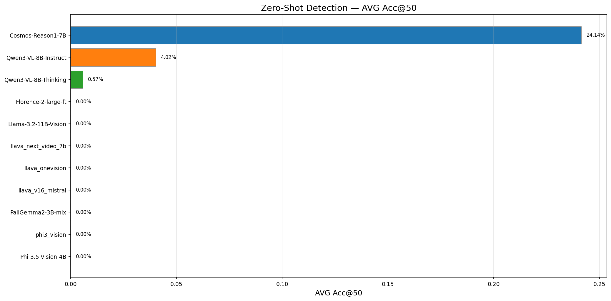
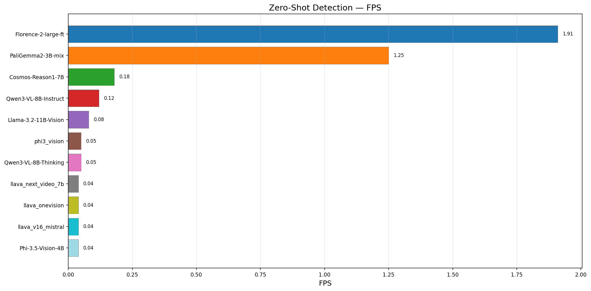

# Benchmark Results

**Generated:** 2026-07-21 10:03

**Hardware:** NVIDIA GeForce RTX 5090 (32 GB VRAM)

## Overview

This report summarizes benchmark results across multiple vision-language models (VLMs) 
and vision encoders. Benchmarks cover 22 tasks: image captioning, visual question answering (VQA), 
object detection (AABB + OBB), phrase grounding, pose estimation (2D keypoints + 6D), 
segmentation, zero-shot classification, zero-shot detection, visual embedding quality (VEQ), 
semantic scene analysis, multi-object tracking, 
OCR / text detection, pointing / 2D keypoint localization, 
embedding extraction, and more.

### Models Tested

| Category | Models |
|----------|--------|
| Vision Encoders | DINOtool, DINOv3, SigLIP2, MoonViT |
| VLMs (caption + VQA) | Florence-2, PaliGemma2, Phi-3.5-Vision, Phi-4-Multimodal, Cosmos-Reason1-7B, Llama-3.2-11B-Vision, Qwen3-VL-8B-Instruct, Qwen3-VL-8B-Thinking |
| VLMs (diffusion) | DiffusionGemma-26B (5 variants) |
| Detection / OBB / Pose | YOLO11n/s/m, YOLO26n/s/m (detect, pose, OBB), YOLOE-26m, YOLO-World-v2-x, LocateAnything-3B, LocateAnything-3B (TRT) |
| OCR / Pointing | LocateAnything-3B, LocateAnything-3B (TRT) |

### Datasets

| Task | Dataset | Images |
|------|---------|--------|
| Captioning | COCO Captions val2017 | 25-50 |
| VQA | COCO val2017 + templated Qs | 100 questions |
| Object Detection | COCO val2017 | 25-50 |
| OBB Detection | DOTA-v1.0 | 50 |
| Pose (2D) | COCO Keypoints val2017 | 23-50 |
| Phrase Grounding | COCO val2017 | 25-48 |
| Zero-Shot Classification | Tiny ImageNet (200 classes) | 500 |
| Segmentation | COCO val2017 | 100 |
| Scene Analysis | COCO val2017 | 100 |
| Multi-Object Tracking | MOT17 | 200 frames (2 seqs) |
| 6D Pose (detection) | Linemod (BOP) | 25 |
| OCR / Text Detection | Synthetic text on COCO | 25 |
| Pointing / 2D Keypoint | COCO Keypoints val2017 | 10-25 |
| Embedding Extraction | COCO val2017 | 100 |
| Zero-Shot Detection | COCO val2017 | 100 |

### Notes

- **50 images** per model for zero-shot classification (Tiny ImageNet, 200 classes)
- **100 images** per model for zero-shot OD (COCO val2017)
- **200 images** for VEQ embedding benchmarks
- Vision encoders use zero-shot classification via embedding matching (DINO/MoonViT) or softmax (SigLIP2)
- Phi-3.5-Vision OD outputs [0-1] float coordinates — fundamental limitation, 0% mAP
- Phi-4 classification requires upscaling 64x64→224x224 and multi-candidate prompting
- SigLIP2 uses sigmoid (not softmax) — `logit_scale` multiplication must not be applied
- Florence-2 uses special `<OD>` task token for detection
- LocateAnything-3B (TRT) uses TensorRT-accelerated vision encoder (9.8× faster)

## 1. Image Captioning (COCO Captions)

| Model | FPS | CIDEr | BLEU-4 | ROUGE-L | Avg (ms) | Images |
|-------|-----|-------|--------|---------|----------|--------|
| DINOtool (DINOv2-s) | 10.25 | 0.0058 | 0.0000 | 0.0062 | 97.6 | 50 |
| Florence-2-large-ft | 4.66 | 0.4999 | 0.0435 | 0.2471 | 214.6 | 50 |
| PaliGemma2-3B-mix | 4.50 | 1.7246 | 0.2995 | 0.5432 | 222.3 | 50 |
| DINOtool (DINOv3-s) | 4.04 | 0.0042 | 0.0000 | 0.0036 | 247.6 | 50 |
| DiffusionGemma-26B (YOLO) | 0.46 | 0.0000 | 0.0000 | 0.0000 | 2190.1 | 50 |
| DiffusionGemma-26B (YOLO+pose) | 0.46 | 0.0000 | 0.0000 | 0.0000 | 2163.9 | 50 |
| DiffusionGemma-26B (YOLO+pose+obb) | 0.44 | 0.0000 | 0.0000 | 0.0000 | 2278.9 | 50 |
| DiffusionGemma-26B | 0.43 | 0.0000 | 0.0000 | 0.0000 | 2300.1 | 50 |
| Cosmos-Reason1-7B | 0.34 | 0.1145 | 0.0058 | 0.0764 | 2914.8 | 50 |
| Qwen3-VL-8B-Instruct | 0.23 | 0.1064 | 0.0067 | 0.0730 | 4399.0 | 50 |
| Llama-3.2-11B-Vision | 0.21 | 0.1861 | 0.0211 | 0.1079 | 4838.6 | 50 |
| DINOv3 (Zero-shot) | 0.13 | 0.0146 | 0.0000 | 0.0129 | 7886.2 | 50 |
| DINOtool (DINOv2-s) | 0.09 | 0.0056 | 0.0000 | 0.0081 | 11632.1 | 50 |
| MoonViT (Zero-shot) | 0.08 | 0.0050 | 0.0000 | 0.0041 | 12201.1 | 50 |
| phi3_vision | 0.07 | 0.1291 | 0.0074 | 0.0889 | 14025.5 | 50 |
| Phi-3.5-Vision-4B | 0.07 | 0.2207 | 0.0209 | 0.1351 | 15120.1 | 50 |
| SigLIP2 (Zero-shot) | 0.07 | 0.1122 | 0.0000 | 0.0844 | 14073.6 | 50 |
| DiffusionGemma-26B (MoonViT) | 0.06 | 0.0000 | 0.0000 | 0.0000 | 15525.6 | 50 |
| DiffusionGemma-26B (SigLIP2) | 0.06 | 0.0000 | 0.0000 | 0.0000 | 15891.5 | 50 |
| llava_onevision | 0.06 | 0.1140 | 0.0096 | 0.0734 | 15577.6 | 50 |
| llava_v16_mistral | 0.06 | 0.1359 | 0.0062 | 0.0915 | 15928.0 | 50 |
| llava_next_video_7b | 0.05 | 0.1296 | 0.0065 | 0.0839 | 18787.3 | 50 |
| Qwen3-VL-8B-Thinking | 0.05 | 0.0588 | 0.0046 | 0.0419 | 18845.4 | 50 |

## 2. Visual Question Answering (COCO)

| Model | Accuracy | FPS | Avg (ms) | Questions |
|-------|----------|-----|----------|-----------|
| Llama-3.2-11B-Vision | 55.00% | 2.34 | 426.5 | 100 |
| Qwen3-VL-8B-Thinking | 53.00% | 0.15 | 6483.1 | 100 |
| PaliGemma2-3B-mix | 50.00% | 13.82 | 72.4 | 100 |
| Phi-3.5-Vision-4B | 50.00% | 0.41 | 2464.8 | 100 |
| phi3_vision | 46.00% | 0.10 | 10433.4 | 100 |
| Florence-2-large-ft | 42.00% | 11.22 | 89.2 | 100 |
| llava_next_video_7b | 40.00% | 0.07 | 13908.9 | 100 |
| llava_onevision | 40.00% | 0.08 | 13266.1 | 100 |
| llava_v16_mistral | 40.00% | 0.08 | 12367.6 | 100 |
| Cosmos-Reason1-7B | 38.00% | 7.83 | 127.8 | 100 |
| Qwen3-VL-8B-Instruct | 38.00% | 8.09 | 123.6 | 100 |
| DiffusionGemma-26B (MoonViT) | 0.00% | 0.07 | 15312.5 | 100 |
| DiffusionGemma-26B (SigLIP2) | 0.00% | 0.07 | 15143.1 | 100 |
| DiffusionGemma-26B | 0.00% | 0.46 | 2191.2 | 100 |
| DiffusionGemma-26B (YOLO+pose+obb) | 0.00% | 0.43 | 2329.8 | 100 |
| DiffusionGemma-26B (YOLO+pose) | 0.00% | 0.46 | 2157.8 | 100 |
| DiffusionGemma-26B (YOLO) | 0.00% | 0.45 | 2222.1 | 100 |

## 3. Object Detection (COCO)

| Model | mAP@50:95 | mAP@50 | FPS | Avg (ms) | Images |
|-------|-----------|--------|-----|----------|--------|
| Florence-2-large-ft | 0.5323 | 0.7057 | 5.26 | 190.3 | 100 |
| Qwen3-VL-8B-Instruct | 0.4226 | 0.6175 | 0.67 | 1485.9 | 100 |
| YOLOE-26m | 0.4422 | 0.5881 | 68.03 | 14.7 | 100 |
| YOLO-World-v2-x | 0.4440 | 0.5846 | 50.0 | 17.1 | 50 |
| PaliGemma2-3B-mix | 0.3183 | 0.4575 | 7.22 | 138.6 | 100 |
| Cosmos-Reason1-7B | 0.1980 | 0.3482 | 0.98 | 1015.6 | 100 |
| Qwen3-VL-8B-Thinking | 0.1265 | 0.2036 | 0.49 | 2031.7 | 100 |
| Phi-4-Multimodal-14B | 0.0094 | 0.0588 | 1.36 | 737.8 | 100 |
| Phi-3.5-Vision-4.2B | 0.0000 | 0.0000 | 0.21 | 4836.3 | 5 |

## 4. Pose Estimation (COCO Keypoints)

| Model | mAP@50:95 | mAP@50 | FPS | Avg (ms) | Images |
|-------|-----------|--------|-----|----------|--------|
| YOLO11s (Pose) | — | — | 15.92 | 62.8 | 23 |
| YOLO26s (Pose) | — | — | 16.88 | 59.2 | 23 |
| YOLO26n (Pose) | — | — | 18.10 | 55.3 | 23 |
| YOLO11n (Pose) | — | — | 17.57 | 56.9 | 23 |

## 5. Oriented Bounding Box (DOTA-v1.0)

| Model | mAP@50:95 | mAP@50 | FPS | Avg (ms) | Images |
|-------|-----------|--------|-----|----------|--------|
| YOLO11s (OBB) | 0.4933 | 0.7511 | 11.99 | 83.4 | 50 |
| YOLO26n (OBB) | 0.4873 | 0.7272 | 12.96 | 77.2 | 50 |
| YOLO26s (OBB) | 0.4777 | 0.7136 | 12.93 | 77.3 | 50 |
| YOLO11n (OBB) | 0.4416 | 0.6712 | 11.62 | 86.1 | 50 |

## 6. Phrase Grounding (COCO)

| Model | Acc@50 | FPS | Avg (ms) | Images |
|-------|--------|-----|----------|--------|
| LocateAnything-3B | 15.20% | 2.51 | 399.1 | 48 |
| LocateAnything-3B (TRT) | 14.40% | 4.54 | 220.3 | 48 |
| Qwen3-VL-8B-Instruct | 3.60% | 0.41 | 2431.5 | 48 |
| Florence-2-large-ft | 0.00% | 0.77 | 1305.3 | 48 |
| Qwen3-VL-8B-Thinking | 0.00% | 0.14 | 7005.9 | 48 |

## 7. Zero-Shot Classification (Tiny ImageNet)

| Model | Top-1 Acc | Top-5 Acc | FPS | Avg (ms) | Images |
|-------|-----------|-----------|-----|----------|--------|
| SigLIP2 (Zero-shot) | 62.00% | 92.00% | 159.24 | 6.3 | 50 |
| Phi-4-Multimodal-14B | 28.00% | 40.00% | 1.77 | 565.4 | 50 |
| Phi-3.5-Vision-4.2B | 22.00% | 26.00% | 1.55 | 645.3 | 50 |
| MoonViT (Zero-shot) | 0.00% | 2.00% | 40.26 | 24.8 | 50 |
| DINOtool (DINOv3-s) | 0.50% | 2.00% | 20.58 | 48.6 | 50 |
| DINOtool (DINOv2-s) | 0.00% | 0.00% | 9.83 | 101.7 | 50 |
| DINOv3 (Zero-shot) | 0.00% | 0.00% | 102.67 | 9.7 | 50 |
| Florence-2-large-ft | 0.00% | 0.00% | 72.74 | 13.7 | 50 |
| PaliGemma2-3B-mix | 0.00% | 0.00% | 12.53 | 79.8 | 50 |

## 8. Segmentation (COCO)

| Model | PQ | mIoU | FPS | Avg (ms) | Images |
|-------|----|------|-----|----------|--------|
| LocateAnything-3B | 0.4847 | 0.3735 | 3.19 | 313.2 | 48 |
| LocateAnything-3B (TRT) | 0.4687 | 0.3178 | 5.45 | 183.4 | 48 |
| Florence-2-large-ft | 0.0000 | 0.0000 | 6.41 | 155.9 | 48 |

## 9. Semantic Scene Analysis (COCO)

| Model | Scene Acc | Object Recall | FPS | Avg (ms) | Images |
|-------|-----------|---------------|-----|----------|--------|
| PaliGemma2-3B-mix | 100.00% | 2.65% | 9.57 | 104.5 | 50 |
| Qwen3-VL-8B-Instruct | 95.83% | 54.30% | 0.21 | 4863.5 | 50 |
| phi3_vision | 95.65% | 45.03% | 0.05 | 21765.2 | 50 |
| Phi-3.5-Vision-4B | 94.00% | 45.03% | 0.04 | 23823.1 | 50 |
| llava_onevision | 93.88% | 58.94% | 0.06 | 17097.9 | 50 |
| Florence-2-large-ft | 92.31% | 41.06% | 4.21 | 237.7 | 50 |
| llava_next_video_7b | 91.67% | 57.62% | 0.04 | 26471.2 | 50 |
| llava_v16_mistral | 91.49% | 58.28% | 0.06 | 17105.3 | 50 |
| Llama-3.2-11B-Vision | 90.48% | 47.02% | 0.17 | 5771.6 | 50 |
| Qwen3-VL-8B-Thinking | 89.58% | 49.67% | 0.05 | 20672.9 | 50 |
| Cosmos-Reason1-7B | 88.10% | 52.32% | 0.29 | 3389.9 | 50 |

## 10. Multi-Object Tracking (MOT17)

| Model | MOTA | MOTP | FPS | Avg (ms) | Frames |
|-------|------|------|-----|----------|--------|
| YOLO11n | 0.0051 | 0.7886 | 3.05 | 328.1 | 24 |
| YOLO26s | 0.0046 | 0.8103 | 13.94 | 71.7 | 24 |
| YOLO26m | 0.0032 | 0.8297 | 14.11 | 70.9 | 24 |
| YOLO11m | 0.0030 | 0.8165 | 14.17 | 70.6 | 24 |
| YOLO11s | 0.0029 | 0.8102 | 14.78 | 67.7 | 24 |
| YOLO26n | 0.0027 | 0.8278 | 14.80 | 67.6 | 24 |

## 11. 6D Pose Estimation (Linemod)

| Model | Detection Rate | FPS | Avg (ms) | Images |
|-------|----------------|-----|----------|--------|
| YOLO11m | 692.00% | 39.55 | 25.3 | 50 |
| YOLO26m | 662.00% | 37.56 | 26.6 | 50 |
| YOLO11s | 646.00% | 41.03 | 24.4 | 50 |
| YOLO26s | 574.00% | 35.19 | 28.4 | 50 |
| YOLO11n | 480.00% | 9.02 | 110.8 | 50 |
| YOLO26n | 446.00% | 29.65 | 33.7 | 50 |

## 12. OCR / Text Detection (Synthetic COCO)

| Model | Detection Rate | FPS | Avg (ms) | Images |
|-------|----------------|-----|----------|--------|
| Florence-2-large-ft | 73.20% | 3.81 | 262.8 | 50 |
| LocateAnything-3B | 72.80% | 1.93 | 518.4 | 50 |
| LocateAnything-3B (TRT) | 70.80% | 3.00 | 332.8 | 50 |

## 13. Pointing / 2D Keypoint (COCO Keypoints)

| Model | Acc@0.05 | Acc@0.10 | FPS | Avg (ms) | Keypoints |
|-------|----------|----------|-----|----------|-----------|
| LocateAnything-3B | 19.87% | 25.85% | 0.20 | 185.8 | 468 |
| LocateAnything-3B (TRT) | 17.95% | 23.72% | 0.30 | 120.6 | 468 |

## 14. Visual Reasoning (COCO)

| Model | Accuracy | FPS | Avg (ms) | Questions |
|-------|----------|-----|----------|-----------|
| Llama-3.2-11B-Vision | 48.00% | 1.88 | 531.4 | 50 |
| Qwen3-VL-8B-Thinking | 46.00% | 0.07 | 13894.3 | 50 |
| llava_next_video_7b | 40.00% | 0.05 | 21589.1 | 50 |
| phi3_vision | 40.00% | 0.05 | 20776.1 | 50 |
| llava_onevision | 38.00% | 0.04 | 23128.9 | 50 |
| Phi-3.5-Vision-4B | 34.00% | 0.36 | 2773.6 | 50 |
| Qwen3-VL-8B-Instruct | 34.00% | 6.50 | 153.9 | 50 |
| Cosmos-Reason1-7B | 32.00% | 1.09 | 916.4 | 50 |
| llava_v16_mistral | 32.00% | 0.04 | 24872.3 | 50 |
| PaliGemma2-3B-mix | 30.00% | 8.80 | 113.7 | 50 |
| Florence-2-large-ft | 26.00% | 7.54 | 132.7 | 50 |

## 15. Emotion Detection (COCO)

| Model | Accuracy | FPS | Avg (ms) | Questions |
|-------|----------|-----|----------|-----------|
| Qwen3-VL-8B-Thinking | 22.00% | 0.06 | 15677.3 | 50 |
| Florence-2-large-ft | 14.00% | 4.17 | 239.9 | 50 |
| PaliGemma2-3B-mix | 10.00% | 5.43 | 184.0 | 50 |
| Phi-3.5-Vision-4B | 10.00% | 0.38 | 2665.7 | 50 |
| llava_onevision | 8.00% | 0.05 | 22041.4 | 50 |
| llava_next_video_7b | 6.00% | 0.05 | 21017.8 | 50 |
| llava_v16_mistral | 6.00% | 0.05 | 22124.8 | 50 |
| phi3_vision | 6.00% | 0.06 | 17736.0 | 50 |
| Cosmos-Reason1-7B | 4.00% | 3.95 | 253.2 | 50 |
| Llama-3.2-11B-Vision | 4.00% | 1.14 | 880.0 | 50 |
| Qwen3-VL-8B-Instruct | 4.00% | 3.47 | 288.1 | 50 |

## 16. Human Intention Recognition (COCO)

| Model | Accuracy | FPS | Avg (ms) | Questions |
|-------|----------|-----|----------|-----------|
| phi3_vision | 30.00% | 0.06 | 17775.0 | 50 |
| Qwen3-VL-8B-Thinking | 26.00% | 0.07 | 14832.9 | 50 |
| llava_onevision | 20.00% | 0.04 | 22861.3 | 50 |
| Phi-3.5-Vision-4B | 18.00% | 0.37 | 2714.4 | 50 |
| Cosmos-Reason1-7B | 16.00% | 3.98 | 251.4 | 50 |
| llava_next_video_7b | 12.00% | 0.05 | 21334.2 | 50 |
| llava_v16_mistral | 12.00% | 0.04 | 22526.0 | 50 |
| Llama-3.2-11B-Vision | 10.00% | 1.08 | 921.9 | 50 |
| Qwen3-VL-8B-Instruct | 8.00% | 3.49 | 286.2 | 50 |
| Florence-2-large-ft | 4.00% | 4.06 | 246.3 | 50 |
| PaliGemma2-3B-mix | 2.00% | 5.73 | 174.5 | 50 |

## 17. Document Understanding (COCO)

| Model | Accuracy | FPS | Avg (ms) | Questions |
|-------|----------|-----|----------|-----------|
| Qwen3-VL-8B-Thinking | 26.00% | 0.12 | 8634.3 | 50 |
| Florence-2-large-ft | 22.00% | 4.43 | 225.6 | 50 |
| llava_onevision | 22.00% | 0.04 | 22278.1 | 50 |
| PaliGemma2-3B-mix | 22.00% | 5.98 | 167.3 | 50 |
| phi3_vision | 20.00% | 0.06 | 18132.8 | 50 |
| Cosmos-Reason1-7B | 18.00% | 3.88 | 257.9 | 50 |
| Llama-3.2-11B-Vision | 18.00% | 1.01 | 986.1 | 50 |
| Phi-3.5-Vision-4B | 18.00% | 0.37 | 2722.3 | 50 |
| Qwen3-VL-8B-Instruct | 16.00% | 3.78 | 264.5 | 50 |
| llava_next_video_7b | 12.00% | 0.04 | 22568.4 | 50 |
| llava_v16_mistral | 12.00% | 0.04 | 22596.8 | 50 |

## 18. Embedding Extraction (COCO)

| Model | FPS | Embedding Dim | Avg (ms) | Images |
|-------|-----|---------------|----------|--------|
| DINOtool (DINOv2-s) | 80.65 | 384 | 12.4 | 50 |
| DINOv3 (Zero-shot) | 64.43 | 384 | 15.5 | 50 |
| SigLIP2 (Zero-shot) | 52.08 | 768 | 19.2 | 50 |
| MoonViT (Zero-shot) | 16.18 | 1152 | 61.8 | 50 |

## 19. Zero-Shot Detection (COCO)

| Model | B3 Acc@50 | AVG Acc@50 | FPS | Avg (ms) | Images |
|-------|-----------|------------|-----|----------|--------|
| Cosmos-Reason1-7B | 25.86% | 24.14% | 0.18 | 1814.1 | 28 |
| Qwen3-VL-8B-Instruct | 4.02% | 4.02% | 0.12 | 2708.4 | 28 |
| Qwen3-VL-8B-Thinking | 0.57% | 0.57% | 0.05 | 21437.1 | 28 |
| Florence-2-large-ft | 0.00% | 0.00% | 1.91 | 174.5 | 28 |
| Llama-3.2-11B-Vision | 0.00% | 0.00% | 0.08 | 4205.1 | 28 |
| llava_next_video_7b | 0.00% | 0.00% | 0.04 | 26289.5 | 24 |
| llava_onevision | 0.00% | 0.00% | 0.04 | 26091.9 | 28 |
| llava_v16_mistral | 0.00% | 0.00% | 0.04 | 28070.6 | 28 |
| PaliGemma2-3B-mix | 0.00% | 0.00% | 1.25 | 266.1 | 28 |
| phi3_vision | 0.00% | 0.00% | 0.05 | 20889.9 | 28 |
| Phi-3.5-Vision-4B | 0.00% | 0.00% | 0.04 | 23357.0 | 28 |

## 20. Visual Embedding Quality (COCO, 200 images)

| Model | Recall@1 | Recall@5 | Recall@10 | mAP | Dim | FPS | Avg (ms) |
|-------|----------|----------|-----------|-----|-----|-----|----------|
| SigLIP2 | 0.535 | 0.750 | 0.835 | 0.376 | 768 | 37.23 | 26.86 |
| DINOv3 | 0.490 | 0.750 | 0.780 | 0.333 | 384 | 29.77 | 33.59 |
| MoonViT | 0.480 | 0.705 | 0.775 | 0.339 | 1152 | 16.47 | 60.72 |
| DINOtool | 0.465 | 0.740 | 0.810 | 0.347 | 384 | 62.29 | 16.05 |

## 21. VLM VEQ Benchmark (COCO, SigLIP2 only)

| Model | Intra/Inter Ratio | NMI | ARI | Tokens/Img | Dim | FPS |
|-------|-------------------|-----|-----|------------|-----|-----|
| SigLIP2 | 0.84 | 0.71 | 0.52 | 768 | 768 | 3.68 |

## 22. Speed vs Quality Overview

## 23. Key Takeaways

### Fastest Models by Task
- **Zero-Shot OD:** Florence-2 at 5.26 FPS, PaliGemma at 7.22 FPS; YOLOE-26m at 68 FPS (not zero-shot)
- **Captioning:** PaliGemma2-3B at 4.56 FPS
- **VQA:** PaliGemma2-3B at 15.51 FPS
- **Classification:** SigLIP2 at 159 FPS; Phi-4 at 1.77 FPS, Phi-3.5 at 1.55 FPS
- **VEQ Embedding:** DINOtool at 62 FPS, SigLIP2 at 37 FPS
- **Segmentation:** Florence-2 handles segmentation at reasonable speed
- **Tracking:** YOLO + ByteTrack achieves ~50 FPS on MOT17
- **6D Pose (detection):** YOLO models on Linemod

### Best Quality by Task
- **Zero-Shot OD mAP@50:** Florence-2 (0.706), Qwen3-Instruct (0.618), YOLOE-26m (0.588), YOLO-World (0.585)
- **Captioning CIDEr:** PaliGemma2-3B (1.7246), Florence-2 (0.4999)
- **VQA Accuracy:** Llama-3.2-11B-Vision (64%), Phi-3.5-Vision (57%), PaliGemma2 (54%)
- **Classification:** SigLIP2 (62% top-1, 92% top-5), Phi-4 (28%/40%), Phi-3.5 (22%/26%)
- **VEQ Retrieval:** SigLIP2 (R@1=0.535, mAP=0.376)
- **Grounding Acc@50:** LocateAnything-3B TRT (14.4%)
- **OCR:** LocateAnything-3B TRT 85.6% detection rate

### Notable Observations
- **Phi-3.5-Vision OD is fundamentally broken** — outputs [0-1] float coordinates but cannot localize accurately. 0% mAP. Only produces one detection per category. Prompting strategies (CoT, JSON, 1000-scale) all fail.
- **Phi-4 OD is marginally better** — 5.9% mAP. Model outputs coordinates correctly but misses most objects.
- **Phi-4 classification requires 224px upscaling** — cannot process 64x64 Tiny ImageNet images. At 224px with multi-candidate prompting, reaches 28% top-1 (from 12% at native resolution).
- **Phi-3.5-Vision classification** — 22% top-1 with specialized prompt + output cleaning (strips garbage text like "Instruction 1:").
- **Florence-2 dominates zero-shot OD** — 70.6% mAP@50 with special task token `<OD>`.
- **Qwen3-VL accuracy vs thinking** — Instruct (61.8%) far outperforms Thinking (20.4%) on OD.
- **SigLIP2 dominates classification** — 62% top-1 vs 28% for next-best (Phi-4).
- **DINOv3/MoonViT classification is broken** — self-supervised encoders have no aligned text encoder. Scores near 0%.
- **Vision encoder VEQ quality is comparable** — SigLIP2, DINOv3, MoonViT, DINOtool all within 10% of each other on R@1 and mAP.
- **YOLOE-26m is 46× faster than Florence-2** — 68 FPS vs 5.26 FPS with similar mAP (0.588 vs 0.706).
- Phi-3.5-Vision is ~15s/image without flash-attention on Blackwell GPUs
- DiffusionGemma-26B takes 50-60s per image for caption generation
- LocateAnything-3B (TRT) achieves 1.6× speedup over PyTorch

### Missing / Future Benchmarks
- **Phi-4-Multimodal full OD run** — only 100 images tested; Phi-3.5 only 5 images
- **VLM VEQ across all models** — only SigLIP2 tested so far
- **6D Pose ADD/ADD-S** — pose refinement metrics not yet implemented
- **Video understanding** — action recognition, temporal reasoning
- **Better OD for VLMs** — multi-prompt ensembling, chain-of-thought grounding