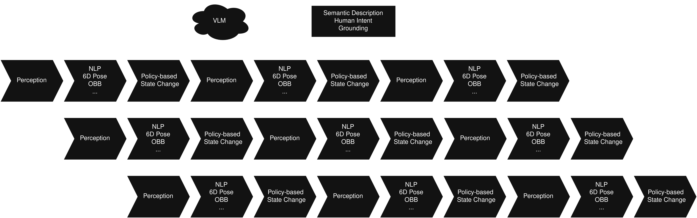
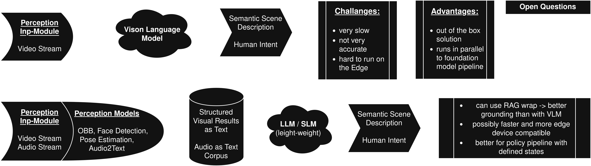

# Overview

Input-Interface|  Module  | Output-Interface
---------------|----------|-----------------
Video-Stream   | VLM      | Perception-Input (Feature Fusion) 
(Perception Output) | (LLM) | (Statemachine)

VLMs could support with: 
- Semantic Scene Descriptions/Analysis
- Human Intetent
- Visual Grounding
- (Detection, Pose Estimation)
- Infer/recommend Behaviour Policy Changes

LLMs can do the same but need the Processed perception in text form (structured detection strings, filtered Post-NLP output)  
VLMs are more of a parallel running add-on that should only run event triggered to ask scene related contet foundation models can not retrieve.  
LLMs could potentially run in parallel less heavy information delay - used as knowledge extractor to derive insights from perception pipeline and can act as stabilizer as it can consume roboter past state and perception and be limited to defined world when wrapped in a RAG.

## Needed Input Interfaces
depending on implementation: 
- access to <b>raw video stream</b> for VLM ingestion
- access to the <b>structured output of the perception models in text form</b> for LLM processing

## Needed Output Interfaces
<b>Feature Fusion Layer</b> of perception pipeline to publish results. 
If VL or LL models and their integration work well, maybe even direct link to policy decision maker could be feasable to influence state transitions based on VLM/LLM analysis results. 

## Visualizatons of Concepts

  

LLM Pipeline Plan similarly to [Art of the Problem - Robot Project](https://www.youtube.com/watch?v=S67z2aekBrI)

## Potential Architectures 
### VLMs
- Qwen3-VL (thinking/instruct)
- Cosmos Nemotron
- Llama-Vision
- Pali-Gemma
- Phi-Vision
- Florence 2
  
### LLMs
- Diffusion Gemma
- LFM 2.5
- Llama 3.2